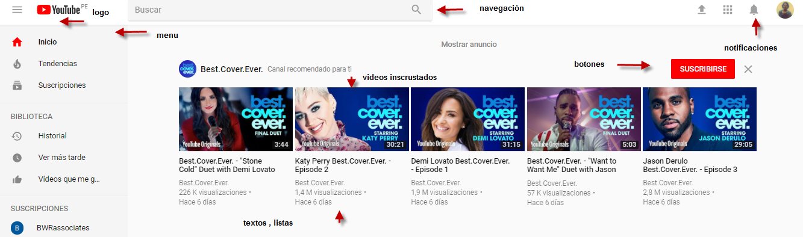

### UX_UI YOUTUBE
#### UI

#### UX 
+ tiene una interfaz gráfica amigable .
+ nombre de logo YouTube enfocado en ti.
+ se basa en videos de entretenimineto ,información al user.
+ resuelve al usuario el problema de ver un video master de nos brinda esa opción , el de guardar videos favoritos, el subir videos para compartir.
+ colores rojo ,es expresivo al amor ,pasión y euforia. 
+ tiene opciones de compartir por redes sociales.
+ satisface a los auspicioadores ya que incluye,comerciales y promociones en sus videos.
+se enfoca en als emociones para dar like o dislike.   

